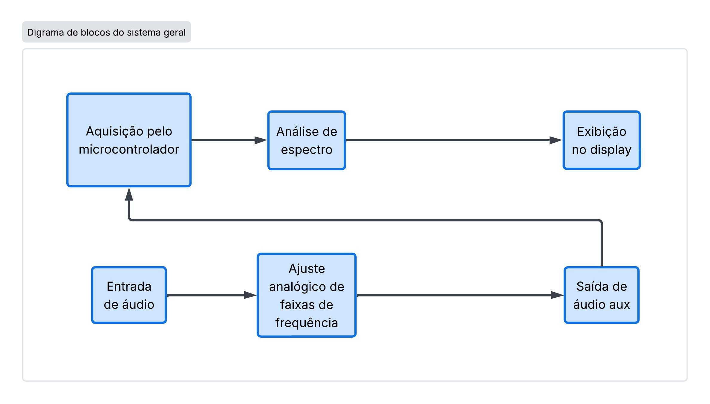

# Equalizador Analógico com Visualização de Espectro

Este projeto consiste no desenvolvimento de um **equalizador de áudio analógico**, capaz de ajustar diferentes faixas de frequência de um sinal de áudio. O sistema também contará com uma visualização do espectro de frequências do sinal, permitindo observar de forma gráfica a distribuição das componentes do áudio. O desenvolvimento será dividido em quatro etapas:

* [Etapa 1](./etapa_1/README.md) (data da entrega): Pesquisa, planejamento e definição do projeto. [TODO]
* [Etapa 2](./etapa_2/README.md) (data da entrega): Desenvolvimento e testes dos circuitos. [TODO]
* [Etapa 3](./etapa_3/README.md) (data da entrega): Integração do equalizador com o sistema de visualização. [TODO]
* [Etapa 4](./etapa_4/README.md) (data da entrega): Finalização, testes e análise do projeto. [TODO]

## Requisitos [TODO]

Este projeto será desenvolvido utilizando os seguintes componentes e ferramentas:

* Circuitos analógicos para processamento e equalização do sinal de áudio.
* Amplificadores operacionais.
* Microcontrolador STM32F411CEU6 para aquisição e processamento do sinal.
* Display para visualização do espectro de frequências.
* LTspice para simulação dos circuitos.
* Ferramentas de desenvolvimento para o microcontrolador STM32.

## Visão geral [TODO]

O sistema recebe um sinal de áudio, realiza o processamento analógico para ajustar suas diferentes faixas de frequência e disponibiliza o sinal resultante para a saída de áudio. Paralelamente, o sinal é adquirido pelo microcontrolador, que realiza a análise de seu espectro de frequências e apresenta os resultados graficamente em um display.

## Protótipo [TODO]

**(Adicionar aqui uma foto do protótipo.)**

O protótipo consiste no circuito desenvolvido para realizar a equalização do sinal de áudio e no sistema responsável pela aquisição e visualização de seu espectro de frequências. Nesta etapa, serão apresentados os componentes e a montagem física utilizados para a implementação do projeto.

