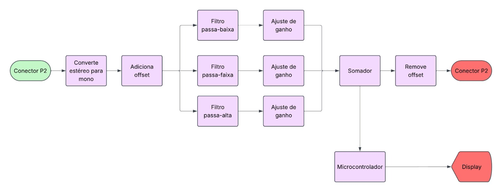
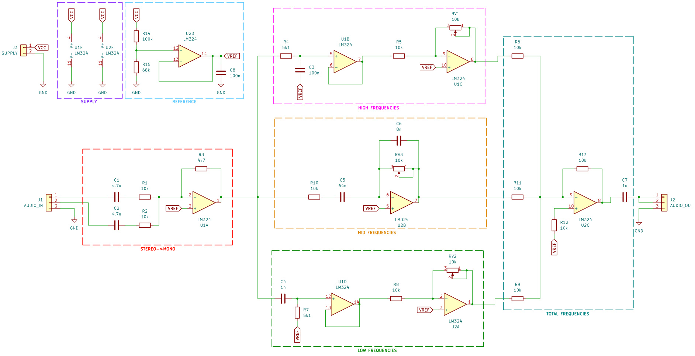
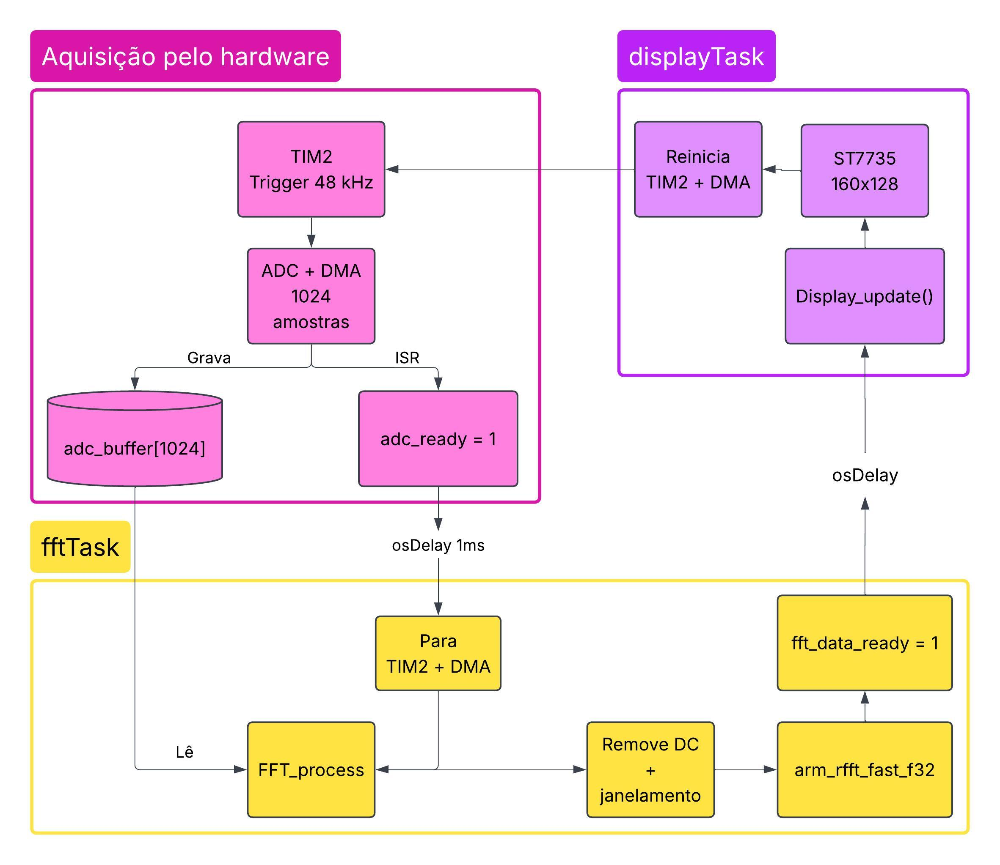
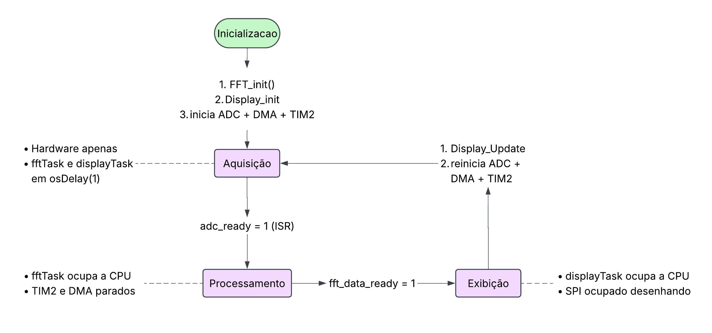

# Etapa 2

A Etapa 2 teve como objetivo consolidar o projeto do equalizador, definindo a arquitetura do circuito analógico, a estrutura do firmware, a interface de áudio do módulo e o esquemático elétrico. Ao final da etapa, foram concluídas as quatro subentregas previstas: o diagrama de blocos do circuito analógico, o projeto do firmware com seus diagramas de blocos e estados, a definição da interface com equipamentos externos e o esquemático analógico completo. A implementação foi organizada de forma a separar as funções de processamento analógico e digital, estabelecendo a estrutura que será utilizada nas etapas posteriores.

## Desenvolvimento

### Circuito analógico

A arquitetura definida para o circuito analógico é apresentada na *Figura 1*. O sinal de entrada é recebido por um conector P2 estéreo e inicialmente convertido para mono pela soma dos dois canais. Em seguida, é adicionado um offset de 2 V, necessário devido à utilização de alimentação simples de 0–5 V. O sinal é então encaminhado para os três caminhos de filtragem, correspondentes às bandas de baixa, média e alta frequência.

*Figura 1 — Diagrama de blocos do circuito analógico.*

As frequências de corte definidas para a implementação atual são 20–318 Hz para a banda baixa, 248–1989 Hz para a banda média e 1768 Hz–20 kHz para a banda alta. A sobreposição entre as bandas foi definida intencionalmente, buscando uma resposta aproximadamente plana quando todas as bandas estiverem configuradas no máximo. Cada caminho possui um ajuste de ganho independente por meio de um potenciômetro analógico. Após a amplificação, os três caminhos são novamente somados. Um capacitor em série na saída remove o offset, permitindo que o sinal retorne a uma referência de 0 V antes de ser disponibilizado no conector P2 de saída.

O circuito utiliza dois circuitos integrados LMC660, totalizando oito amplificadores operacionais. A escolha desse componente considerou sua operação com baixa tensão de alimentação, característica rail-to-rail, baixo ruído de tensão e disponibilidade em encapsulamento DIP, adequado à montagem artesanal da placa. A disponibilidade do componente no mercado brasileiro também foi considerada, uma vez que outras alternativas com características semelhantes apresentavam menor disponibilidade.

A Figura 2 apresenta o esquemático analógico desenvolvido no KiCad. O circuito foi organizado em sete blocos funcionais: alimentação dos amplificadores (Supply), geração da tensão de referência (Reference), conversão estéreo para mono (Stereo → Mono), filtros de alta, média e baixa frequência e o estágio de soma das bandas com remoção do offset (Total Frequencies).

*Figura 2 — Esquemático completo da seção analógica.*

| Componente     | Quantidade | Função                         |
| -------------- | ---------: | ------------------------------ |
| LMC660         |          2 | Amplificação e filtragem       |
| Potenciômetros |          3 | Ajuste de ganho das bandas     |
| Resistores     |          15| Ganho, polarização e filtragem |
| Capacitores    |          8 | Filtragem e remoção do offset  |
| Conectores P2  |          2 | Entrada e saída de áudio       |

### Firmware

O firmware foi projetado para gerenciar a aquisição das amostras de áudio, seu processamento por FFT e a apresentação dos resultados em um display ST7735. O sistema utiliza o STM32F411CEU6 como microcontrolador e foi desenvolvido utilizando o STM32CubeIDE.

O fluxo geral é apresentado na *Figura 3*. Um timer é utilizado para gerar o acionamento do ADC, enquanto o ADC e o DMA realizam a aquisição e o armazenamento das amostras. O conjunto de 1024 amostras é então processado pela fftTask, responsável pela execução da FFT e preparação dos dados que serão apresentados. Por fim, a displayTask realiza a atualização do display por meio da interface SPI.

*Figura 3 — Diagrama de blocos do firmware.*

A organização das operações também foi definida por meio de estados, conforme apresentado na *Figura 4*. O estado de aquisição captura as amostras e as armazena em um buffer. No estado de processamento, os dados são submetidos à FFT e preparados para exibição. Por fim, o estado de exibição atualiza o ST7735 com o resultado correspondente à aquisição atual.

*Figura 4 — Diagrama de estados do firmware.*

Essa organização busca manter separadas as etapas de aquisição, processamento e exibição, facilitando a modularização do firmware e permitindo que cada função seja desenvolvida e ajustada de maneira independente.

## Testes

Nesta etapa foram realizados testes individuais dos filtros analógicos antes da integração do circuito completo. Para isso, foram utilizados sinais de ruído branco e os resultados foram analisados com auxílio do gráfico de FFT do aplicativo Ocenaudio. Os testes permitiram verificar individualmente o comportamento dos filtros de baixa, média e alta frequência.

A análise dos espectros obtidos indicou que as saídas dos três filtros apresentavam comportamento condizente com as frequências de corte estabelecidas no projeto. Dessa forma, foi possível validar individualmente a implementação dos estágios de filtragem e verificar a adequação do amplificador operacional escolhido para essa aplicação.

Os testes do circuito analógico completo, incluindo a combinação das três bandas e a avaliação da resposta geral do equalizador, serão realizados na etapa seguinte, juntamente com as demais validações de integração do projeto.

## Referências (links/datasheets/livros)

- [LMC660](https://www.ti.com/lit/ds/symlink/lmc660.pdf?ts=1790264881760&ref_url=https%253A%252F%252Fwww.ti.com)
- [STMicroelectronics — STM32F411](https://www.st.com/en/microcontrollers-microprocessors/stm32f411/documentation.html)
- [Active Low pass filter](https://www.electronics-tutorials.ws/filter/filter_5.html)
- [Active Band pass filter](https://www.electronics-tutorials.ws/filter/filter_7.html)
- [Active High pass filter](https://www.electronics-tutorials.ws/filter/filter_6.html)